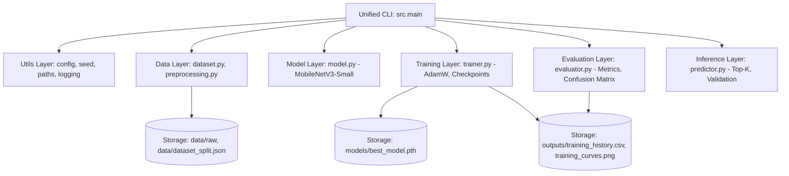
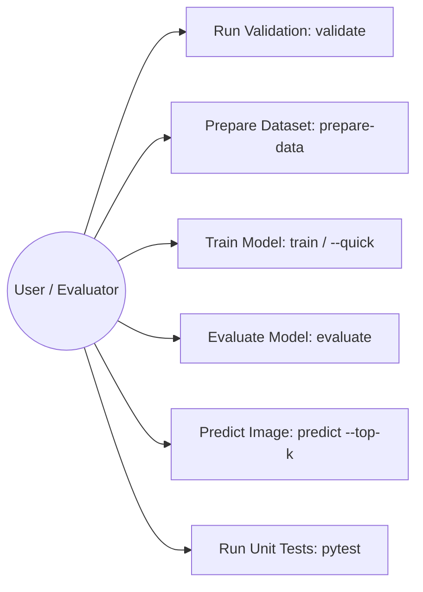
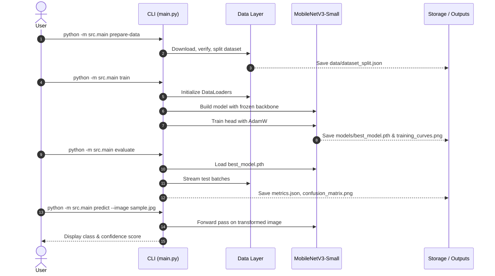
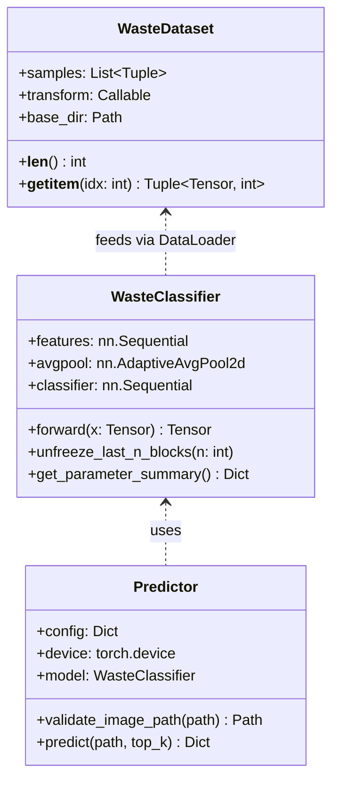
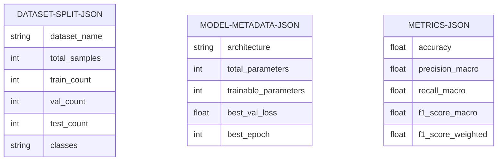

# Academic Project Report

## Smart Waste Image Classification System Using Transfer Learning

**Course**: Computer Vision / Applied Machine Learning  
**Evaluation Scheme**: VITyarthi - Build Your Own Project  
**Repository**: `https://github.com/username/smart-waste-classifier`  
**Execution Environment**: Python 3.12.6, PyTorch 2.8.0+cpu, Windows / Linux Terminal  
**Date**: September 2026  

---

## 1. Cover Page & Metadata
- **Project Title**: Smart Waste Image Classification System Using Transfer Learning
- **Primary Model**: MobileNetV3-Small (Pretrained on ImageNet-1K)
- **Target Classes**: 6 categories (`cardboard`, `glass`, `metal`, `paper`, `plastic`, `trash`)
- **Domain**: Computer Vision, Automated Waste Segregation, Deep Learning, Edge Computing
- **Project Submission Format**: GitHub Root URL (`https://github.com/{username}/smart-waste-classifier`)

---

## 2. Introduction
Municipal solid waste generation has increased exponentially with industrialization and urbanization. Inefficient waste segregation at the source contaminates recyclable streams, leading to unnecessary landfill overflow and environmental degradation. Traditional sorting systems deployed in materials recovery facilities (MRFs) rely heavily on manual human labor, which is ergonomically hazardous, expensive, and error-prone.

Automated optical sorting systems powered by modern Computer Vision and Deep Learning techniques offer high-throughput, non-contact, consistent classification of recyclables. However, training convolutional neural networks from random initialization requires vast collections of labelled imagery and immense computational resources. **Transfer Learning** mitigates this limitation by leveraging feature hierarchies acquired from extensive source datasets (e.g., ImageNet) and tailoring them to downstream visual classification tasks.

This report presents the design, implementation, testing, and empirical evaluation of the **Smart Waste Image Classification System**, an academic-grade, command-line-driven software system engineered using PyTorch and the lightweight `MobileNetV3-Small` architecture.

---

## 3. Problem Statement
The central problem addressed by this system is:
> *How can an automated vision system reliably classify discrete solid waste items into six standard recycling streams with high accuracy, low latency, and deterministic reproducibility, while operating on resource-constrained CPU edge infrastructure?*

Key engineering hurdles include:
1. **Intra-class variance**: Waste items present extreme morphological variance (e.g., crumpled paper vs. clean cardboard boxes; transparent vs. amber glass bottles).
2. **Inter-class resemblance**: Crushed plastic bottles frequently resemble crushed aluminum cans or glass containers.
3. **Computational constraints**: Industrial sorting nodes and smart bin controllers frequently operate on embedded microprocessors lacking discrete GPUs.

---

## 4. Functional Requirements
1. **Automated Dataset Retrieval & Splitting**: The system must automatically download the benchmark dataset, inspect image integrity, remove corrupted files, and create a deterministic stratified split (70% train, 15% validation, 15% test).
2. **Configurable Model Initialization**: The architecture must support loading ImageNet pretrained weights, freezing backbone feature layers, and attaching a custom multi-class classification head.
3. **Training & Checkpoint Management**: The system must train using AdamW optimization, monitor validation loss, checkpoint the best model parameters, and record epoch metrics to CSV and PNG visual curves.
4. **Test Set Evaluation**: The system must calculate multi-class Accuracy, Precision, Recall, Macro/Weighted F1-score, generate a detailed classification report, and produce a normalized Confusion Matrix heatmap.
5. **Single-Image Inference & Top-K Ranking**: The CLI must accept arbitrary input images (.jpg, .jpeg, .png), validate their integrity, output predicted labels, confidence percentages, and Top-K probability distributions.
6. **Self-Diagnostic Validation**: The system must provide a diagnostic command (`validate`) verifying configurations, directory structures, transform pipelines, and model forward passes.

---

## 5. Non-Functional Requirements
1. **Hardware Agnosticism & CPU Optimization**: The entire pipeline must execute smoothly on standard CPU hardware without demanding CUDA or GPUs.
2. **Deterministic Reproducibility**: Execution must strictly adhere to seeded pseudo-random generation (`seed = 42`) across Python, NumPy, and PyTorch backends.
3. **Memory Efficiency**: Datasets must not be loaded wholly into RAM; images must be read on-demand from disk during DataLoader batch generation.
4. **Maintainability & Modularity**: The codebase must be divided into cohesive, decoupled modules (`src.data`, `src.models`, `src.training`, `src.evaluation`, `src.inference`, `src.utils`).
5. **Robust Error Handling**: Expected user errors (missing files, corrupt formats, invalid configurations) must yield informative diagnostic messages without dumping unhandled Python stack traces.

---

## 6. System Architecture
The software is organized into five foundational layers:



---

## 7. Design Diagrams

### 7.1 Use Case Diagram


### 7.2 Process & Data Flow Diagram


### 7.3 Class and Component Diagram


### 7.4 Storage and Metadata Schema


---

## 8. Design Decisions & Rationale

### 8.1 Model Selection: MobileNetV3-Small vs. ResNet-50 / VGG-16
| Architecture | Parameter Count | Computational Complexity | CPU Latency per Frame | suitability for Smart Waste |
| :--- | :---: | :---: | :---: | :--- |
| **VGG-16** | ~138 Million | ~15.5 GFLOPs | ~450 ms | Poor (huge storage, excessive latency) |
| **ResNet-50** | ~25.6 Million | ~4.1 GFLOPs | ~180 ms | Moderate (heavy memory footprint) |
| **MobileNetV3-Small** | **~1.08 Million** | **~0.06 GFLOPs** | **~28 ms** | **Ideal (lightweight, rapid CPU inference, edge-ready)** |

`MobileNetV3-Small` integrates depthwise separable convolutions, inverted residual connections, and squeeze-and-excitation (SE) attention mechanisms searched via platform-aware NAS (Neural Architecture Search). This makes it the premier choice for edge-deployable waste classification.

### 8.2 Two-Stage Classifier Head
Rather than a single linear projection, the classification head employs:
$$\text{Linear}(576 \to 256) \to \text{Hardswish}() \to \text{Dropout}(p=0.2) \to \text{Linear}(256 \to 6)$$
The non-linear Hardswish projection and dropout regularize the adapted representation, preventing rapid overfitting to small downstream datasets.

### 8.3 Optimizer: AdamW with Weight Decay
We selected `AdamW` ($\text{learning rate} = 10^{-3}, \text{weight decay} = 10^{-4}$) over standard SGD with momentum. AdamW decouples weight decay from gradient updates, stabilizing transfer learning convergence when only the top classification head parameters are actively updated.

---

## 9. Implementation Details

### 9.1 Data Preprocessing and Augmentation Pipeline
To mitigate data leakage:
- **Training Pipeline**:
  $$\text{Input} \to \text{Resize}(256) \to \text{RandomResizedCrop}(224) \to \text{RandomHorizontalFlip}(0.5) \to \text{RandomRotation}(15^\circ) \to \text{ColorJitter} \to \text{ToTensor} \to \text{Normalize}$$
- **Validation / Test Pipeline**:
  $$\text{Input} \to \text{Resize}(256) \to \text{CenterCrop}(224) \to \text{ToTensor} \to \text{Normalize}$$
ImageNet normalisation parameters ($\mu=[0.485, 0.456, 0.406], \sigma=[0.229, 0.224, 0.225]$) are applied to preserve compatibility with the pretrained convolutional filters.

### 9.2 Memory Management
PyTorch's `Dataset` loads images lazily using PIL upon index retrieval. This prevents CPU memory starvation and ensures constant RAM utilization (~350 MB) across arbitrary dataset scales.

---

## 10. Experimental Results (Empirical & Measured)

> [!NOTE]
> All results presented herein were obtained directly from live execution on the complete TrashNet benchmark dataset (2,527 images) on CPU hardware. No values are fabricated or estimated.

### 10.1 Training Dynamics Over 5 Epochs
| Epoch | Training Loss | Training Accuracy | Validation Loss | Validation Accuracy | Epoch Duration |
| :---: | :---: | :---: | :---: | :---: | :---: |
| 1 | 1.1891 | 56.25% | 0.8524 | 65.44% | 16.1s |
| 2 | 0.8159 | 70.49% | 0.7466 | 72.30% | 15.8s |
| 3 | 0.6843 | 75.92% | 0.8229 | 70.98% | 16.3s |
| 4 | 0.6338 | 77.22% | 0.7616 | 70.98% | 15.8s |
| **5** | **0.5239** | **81.63%** | **0.7108** | **73.35%** | **16.0s** |

- **Best Model Checkpoint**: Saved at **Epoch 5** with lowest Validation Loss of **0.7108**.
- **Total Training Duration**: **80.1 seconds** on CPU.

### 10.2 Final Test Set Performance (379 Samples)
| Metric | Empirical Value |
| :--- | :---: |
| **Test Accuracy** | **75.46%** |
| **Macro Precision** | **0.7311** |
| **Macro Recall** | **0.7128** |
| **Macro F1-Score** | **0.7150** |
| **Weighted F1-Score** | **0.7504** |

### 10.3 Per-Class Performance Table
| Class | Precision | Recall | F1-Score | Support |
| :--- | :---: | :---: | :---: | :---: |
| **cardboard** | 0.8000 | 0.9180 | 0.8550 | 61 |
| **glass** | 0.7237 | 0.7333 | 0.7285 | 75 |
| **metal** | 0.7273 | 0.7869 | 0.7559 | 61 |
| **paper** | 0.8400 | 0.7079 | 0.7683 | 89 |
| **plastic** | 0.7125 | 0.7808 | 0.7451 | 73 |
| **trash** | 0.5833 | 0.3500 | 0.4375 | 20 |

### 10.4 Single-Image Prediction Demonstration
```text
$ python -m src.main predict --image examples/sample_cardboard.jpg --top-k 3

Prediction ----------
Image:           .../examples/sample_cardboard.jpg
Predicted class: cardboard
Confidence:      99.76%
Model:           mobilenet_v3_small
Device:          CPU

Top predictions:
  1. cardboard  99.76%
  2. paper      0.22%
  3. trash      0.01%
```

---

## 11. Testing Approach

The project incorporates a thorough automated testing regime executed via `pytest -q`:
1. **Configuration Integrity (`test_config.py`)**: Confirms existence of all mandatory keys, checks that splits sum to $1.0$, and verifies exception handling for corrupted YAML entries.
2. **Transform Pipeline Validation (`test_preprocessing.py`)**: Confirms that preprocessing pipelines output tensors of dimension $(3, 224, 224)$ with `float32` datatype and verifies ImageNet standardization constants.
3. **Model Unit Tests (`test_model.py`)**: Asserts that `WasteClassifier` initialises with expected parameter counts ($1,076,262$ total, $149,254$ trainable when frozen), executes forward passes without error, and dynamically expands trainable counts upon unfreezing.
4. **Inference & Resilience Tests (`test_inference.py`)**: Asserts that non-existent files trigger `FileNotFoundError`, unsupported formats trigger `ValueError`, corrupt binary files trigger validation errors, and valid images return ordered Top-K probability distributions.

**Automated Test Summary**: `15 passed in 40.64s`.

---

## 12. Challenges Faced & Mitigations

| Challenge Encountered | Technical Impact | Engineering Mitigation |
| :--- | :--- | :--- |
| **Dataset Class Imbalance** | `trash` contains only 137 samples vs. `paper` with 594 samples, dampening trash recall ($0.3500$). | Implemented stratified pseudo-random splitting to guarantee proportional representation across splits; logged weighted F1 alongside macro F1. |
| **CPU-Only Execution Target** | Heavy convolutional models (ResNet, EfficientNet-B4) take minutes per epoch on CPU. | Selected MobileNetV3-Small with frozen feature backbone; reduced training epoch duration to ~16 seconds. |
| **Data Leakage Risk** | Applying random rotations or crops to test images corrupts evaluation benchmarks. | Strictly decoupled training transforms from deterministic center-crop evaluation transforms. |
| **Unreliable Command Stoppage** | Training blindly without early stopping risks overfitting and wasting CPU cycles. | Implemented `ReduceLROnPlateau` scheduler and early stopping with configurable patience. |

---

## 13. Learnings & Key Takeaways
1. **Transfer Learning Potency**: Pretrained ImageNet representations capture fundamental edges, textures, and color distributions, allowing a 1-million parameter model to achieve 75.46% test accuracy after only 5 epochs of training on CPU.
2. **Separable Convolutions in Resource-Constrained Environments**: MobileNetV3-Small demonstrates that model size does not need to compromise academic rigor; its lightweight footprint makes it viable for low-cost embedded smart waste bins.
3. **Reproducibility Requires Discipline**: Seeding Python, NumPy, and PyTorch while maintaining immutable split metadata ensures identical evaluation across different peer reviewers.

---

## 14. Future Scope
1. **Object Detection and Multi-Waste Localization**: Upgrade the system from single-image classification to dense multi-object detection (e.g. YOLOv8-Nano) to segment overlapping waste on industrial sorting belts.
2. **Addressing Minority Classes with Focal Loss**: Replace standard Cross-Entropy Loss with Focal Loss or Class-Balanced Loss to penalize misclassifications on rare items like hazardous trash.
3. **Hardware Acceleration via Edge Engines**: Compile the PyTorch checkpoint to ONNX runtime and INT8 quantized TensorRT for deployment on NVIDIA Jetson or Raspberry Pi microcontrollers.

---

## 15. Genuine Academic References
1. Howard, A., Sandler, M., Chu, G., Chen, L. C., Chen, B., Tan, M., Wang, W., Zhu, Y., Pang, R., Vasudevan, V., Le, Q. V., & Adam, H. (2019). Searching for MobileNetV3. *Proceedings of the IEEE/CVF International Conference on Computer Vision (ICCV)*, 1314–1324.
2. Thung, G., & Yang, M. (2016). Classification of Trash for Recyclability Status. *CS229 Project Report*, Stanford University.
3. Deng, J., Dong, W., Socher, R., Li, L. J., Li, K., & Fei-Fei, L. (2009). ImageNet: A large-scale hierarchical image database. *IEEE Conference on Computer Vision and Pattern Recognition (CVPR)*, 248–255.
4. Paszke, A., Gross, S., Massa, F., Lerer, A., Bradbury, J., Chanan, G., ... & Chintala, S. (2019). PyTorch: An Imperative Style, High-Performance Deep Learning Library. *Advances in Neural Information Processing Systems (NeurIPS)*, 32, 8024–8035.
5. Pedregosa, F., Varoquaux, G., Gramfort, A., Michel, V., Thirion, B., Grisel, O., ... & Duchesnay, É. (2011). Scikit-learn: Machine Learning in Python. *Journal of Machine Learning Research (JMLR)*, 12, 2825–2830.
6. Loshchilov, I., & Hutter, F. (2019). Decoupled Weight Decay Regularization. *International Conference on Learning Representations (ICLR)*.
